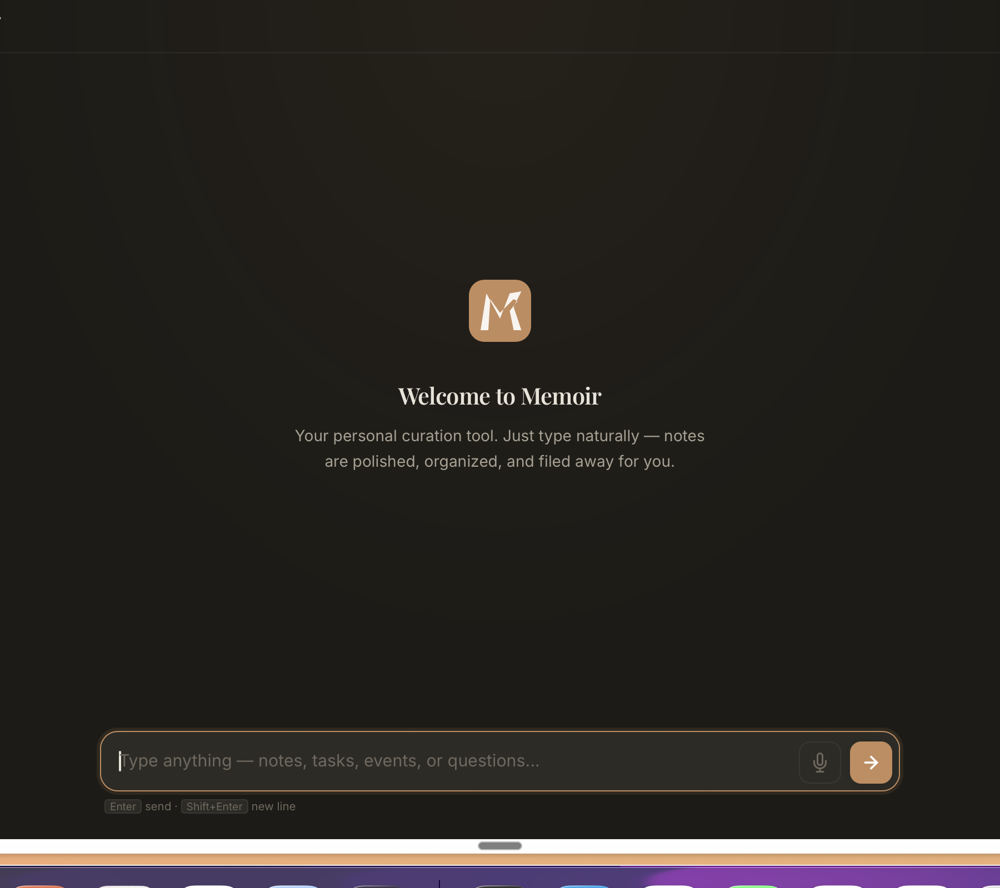

<div align="center">


# Memoir

### One input for everything on your mind.

Notes. Tasks. Calendar events. Bookmarks. Questions.
Just type naturally — AI classifies it and files it in the right place.

**Local-first · Bring your own AI key · Your data never leaves your machine.**

<p>
  <a href="https://github.com/javohirakram/memoir/releases/latest"></a>
  <a href="https://javohirakram.github.io/memoir/"></a>
</p>



</div>

---

## What it does

Most productivity apps force you to pick a category upfront — *is this a note? a task? an event?* — then fill in a form. Memoir removes that friction. One input. Type like you think. The AI figures out the rest.

```
You type                                          Memoir does
─────────────────────────────────────────────────────────────────────────────
"call dentist tomorrow at 3pm"                    → Creates a task,
                                                    due tomorrow 15:00

"idea — AI that summarizes podcasts"              → Saves as a note,
                                                    tagged ideas

"team standup every Monday 9am starting next week"→ Creates a recurring event

"https://nytimes.com/article-about-ai"            → Saves as a bookmark

"what did I write about React last week?"         → Searches your notes
```

## Features

- **Natural-language input** — type the way you think, no forms, no folders
- **AI intent classification** — note, task, event, bookmark, search, or question
- **Local-first storage** — a single JSON file on your machine, you own it
- **Bring your own AI key** — Memoir charges nothing; you pay your provider directly
- **Four AI providers** — Google Gemini, OpenAI, Anthropic Claude, or Ollama (fully offline)
- **Full keyboard UX** — Enter sends, Shift+Enter new line, Esc closes modals
- **Export anytime** — one click, everything to a JSON file you can import anywhere
- **Dark mode first** — warm copper/gold palette, Playfair Display + Inter typography

## Download & install

### macOS (Apple Silicon)

1. [**Download the latest `.dmg`**](https://github.com/javohirakram/memoir/releases/latest)
2. Open the `.dmg`, drag **Memoir.app** to your Applications folder, eject the disk
3. **First launch only:** open Applications in Finder, **right-click Memoir.app → Open**, then click **Open** in the warning dialog
   <details>
   <summary>Why the warning?</summary>

   Memoir is signed ad-hoc (not notarized by Apple). Apple notarization requires a $99/year developer account which Memoir doesn't have. The app is open-source and you can audit every line in this repo.

   If you see **"Memoir is damaged and should be moved to Trash,"** run this in Terminal once:
   ```bash
   xattr -cr /Applications/Memoir.app
   ```
   </details>
4. Done — Memoir launches from Applications or Spotlight like any other app

### In your browser (no install)

Go to **[javohirakram.github.io/memoir](https://javohirakram.github.io/memoir/)**. Same app, runs entirely in the browser, data lives in `localStorage`.

|                       | Desktop app                                  | Browser version      |
| --------------------- | -------------------------------------------- | -------------------- |
| Install needed        | Yes (one-time)                               | No                   |
| Storage               | JSON file in `~/Library/Application Support` | Browser localStorage |
| Survives cache clears | ✅                                           | ❌                   |
| Auto-updates          | Manual (download new `.dmg`)                 | Automatic            |

## Getting an AI key

Memoir defaults to **Google Gemini** because its free tier is the most generous (1,500 requests/day — more than you'll ever hit).

| Provider              | Free tier                        | Key page                                                                    |
| --------------------- | -------------------------------- | --------------------------------------------------------------------------- |
| **Gemini** *(default)*| 1,500 requests/day               | [aistudio.google.com/apikey](https://aistudio.google.com/apikey)            |
| OpenAI                | ~$5 starter credit               | [platform.openai.com/api-keys](https://platform.openai.com/api-keys)        |
| Anthropic Claude      | $5 starter credit                | [console.anthropic.com](https://console.anthropic.com/settings/keys)        |
| Ollama                | Free forever (runs locally)      | Install from [ollama.com](https://ollama.com) → `ollama pull llama3.2`       |

**To add your key:** open Memoir → click the **profile icon** (top right) → **Settings** → paste your key → **Save**.

## Where your data lives

### Desktop app
```
~/Library/Application Support/app.memoir.desktop/memoir.json
```
A single human-readable JSON file. Back it up, sync it via iCloud Drive / Dropbox, or version-control it — your call.

### Browser version
`localStorage` key `memoir_v1` on `javohirakram.github.io`. Export anytime from Settings → **Export data**.

## Architecture

Memoir is a **Tauri 2** desktop app with a vanilla JavaScript frontend. No framework, no bundler, no build step for the frontend — just HTML, CSS, and JS.

```
┌──────────────────────────────────────────┐
│  Memoir.app (Tauri window)               │
│                                          │
│  ┌────────────────────────────────────┐  │
│  │  Web frontend (web/)               │  │
│  │  • index.html / script.js / style  │  │
│  │  • local-api.js — fetch shim that  │  │
│  │    intercepts /api/* calls and     │  │
│  │    routes to Gemini/OpenAI/etc.    │  │
│  └──────────────┬─────────────────────┘  │
│                 │                        │
│                 ▼                        │
│  ┌────────────────────────────────────┐  │
│  │  Rust backend (src-tauri/)         │  │
│  │  • read_store / write_store        │  │
│  │  • log_debug                       │  │
│  │  ~9kb of glue code                 │  │
│  └────────────────────────────────────┘  │
│                 │                        │
│                 ▼                        │
│     ~/Library/.../memoir.json            │
└──────────────────────────────────────────┘
```

The **same frontend** runs in the browser at [javohirakram.github.io/memoir](https://javohirakram.github.io/memoir/) — Tauri is only a thin shell that replaces `localStorage` with real file storage.

## Build from source

### Prerequisites
- [Rust](https://rustup.rs) (stable)
- [Tauri CLI](https://tauri.app): `cargo install tauri-cli --version "^2.0" --locked`
- Xcode Command Line Tools (macOS): `xcode-select --install`

### Build

```bash
git clone https://github.com/javohirakram/memoir.git
cd memoir
cargo tauri build
```

Output: `src-tauri/target/release/bundle/macos/Memoir.app` and `…/dmg/Memoir_x.y.z_aarch64.dmg`.

### Dev

```bash
# Serve the frontend on :1420 (Tauri expects a dev server)
cd web && python3 -m http.server 1420 &

# In another shell, start Tauri in dev mode with hot reload
cargo tauri dev
```

### Project structure

```
memoir/
├── web/                # Frontend (HTML/CSS/JS) — also served by GitHub Pages
│   ├── index.html      # App shell
│   ├── script.js       # UI logic (~3000 lines)
│   ├── style.css       # Design system
│   ├── local-api.js    # Fetch interceptor + 4 provider adapters
│   └── vendor/         # marked, dompurify, turndown (bundled locally)
├── src-tauri/          # Rust + Tauri desktop wrapper
│   ├── src/lib.rs      # Tauri commands (read_store, write_store, log_debug)
│   ├── Cargo.toml
│   ├── tauri.conf.json
│   └── icons/
├── .github/workflows/  # CI: GitHub Pages deploy + desktop release builds
│   ├── pages.yml
│   └── release.yml
└── docs/images/        # README assets
```

## Roadmap

- [x] Local-first storage via JSON file
- [x] Multi-provider AI (Gemini / OpenAI / Anthropic / Ollama)
- [x] Settings modal with provider + model selection
- [x] GitHub Pages browser version
- [x] macOS Apple Silicon build
- [ ] Intel macOS build (CI workflow exists, needs a tag push to trigger)
- [ ] Windows + Linux builds via GitHub Actions
- [ ] Proper app notarization (requires Apple Developer account)
- [ ] Markdown export for notes
- [ ] Custom AI system prompts per-user

## Contributing

Issues and PRs welcome. This is a personal project so response times vary, but I read everything.

## License

[MIT](LICENSE) — do whatever you want with it.

---

<div align="center">

Built by [Javohir Akramov](https://github.com/javohirakram) ·
[Report a bug](https://github.com/javohirakram/memoir/issues) ·
[Request a feature](https://github.com/javohirakram/memoir/issues)

</div>
